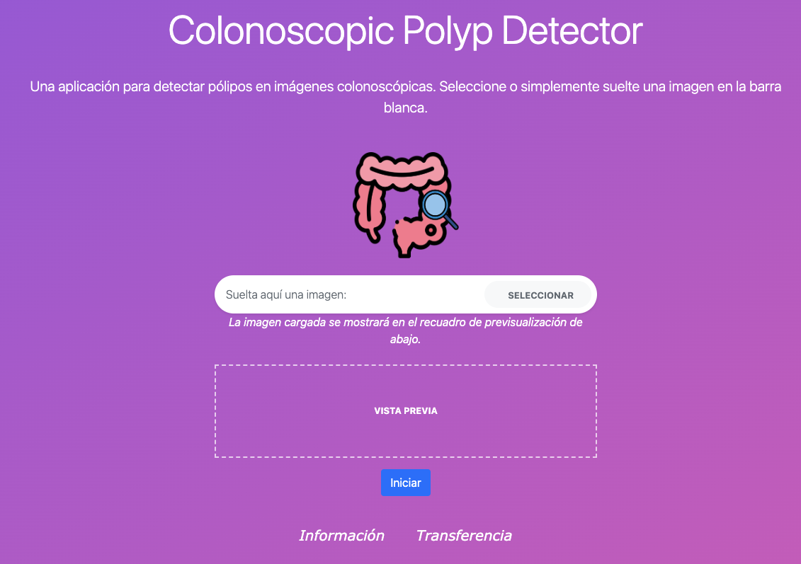

# Polyp Detection

This web app is made using Flask framework and is all about predicting a polyp in a colonoscopic image based on the deep learning model trained using small CNNs.

{width=50%}

# Dependencies
- Python == 3.8
- Flask == 2.2.1
- keras == 2.10.0
- numpy == 1.23.2
- Pillow == 9.3.0
- tensorflow == 2.10.0
- scikit-image == 0.21.0
- scikit-learn == 1.3.0 
- opencv-python == 4.8.0.74

## UI Framework

- Bootstrap

# Install Dependencies

Install the dependencies from the **requirements.txt** file.

```commandline
pip install -r requirements.txt
```

# Run

**cd** into the current directory and run the script.

```commandline
flask --app app.py run
```

# Test

- Choose an image from the test images folder.
- You will see a preview of the uploaded image.
- Click on **Predict** button and see the prediction.
